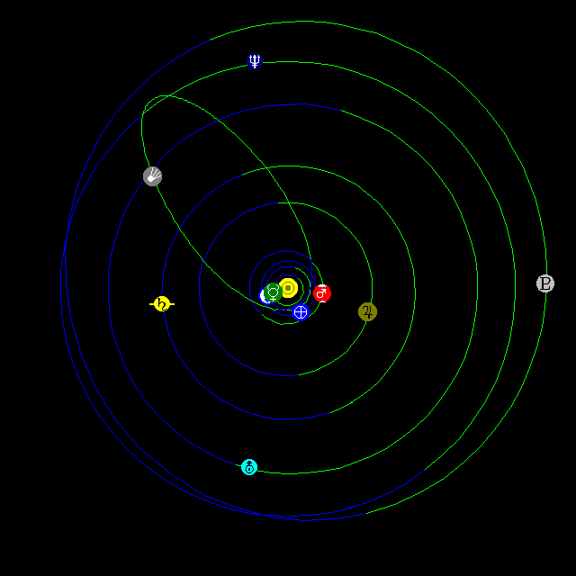

# Solar System Live

[*Solar System Live*](https://www.fourmilab.ch/solar/)
is an interactive orrery for the Web that lets you view the solar 
system in a variety of ways for any date between 4713 B.C. and A.D. 
8000.  An ephemeris can be displayed for any location on Earth and, 
given orbital elements in the form published in the IAU Circulars and 
the Jet Propulsion Laboratory, the orbit and position of asteroids and 
comets can be plotted.

This repository maintains the master copies of the Solar System Live 
Web application source code and the Web tree for the program.

## Structure of the repository

This repository is organised into the following directories.

* **webtree**: Replica of the Web tree from the Fourmilab site
containing all of the HTML documents, and images.  These
pages contain relative references to style sheets, icons, and other
resources on the Fourmilab Web site and will not display properly
without modification in other environments.

* **src**: Source code for the Solar System Live program, which runs
as a Common Gateway Interface (CGI) application invoked by a Web
server processing a user request.

